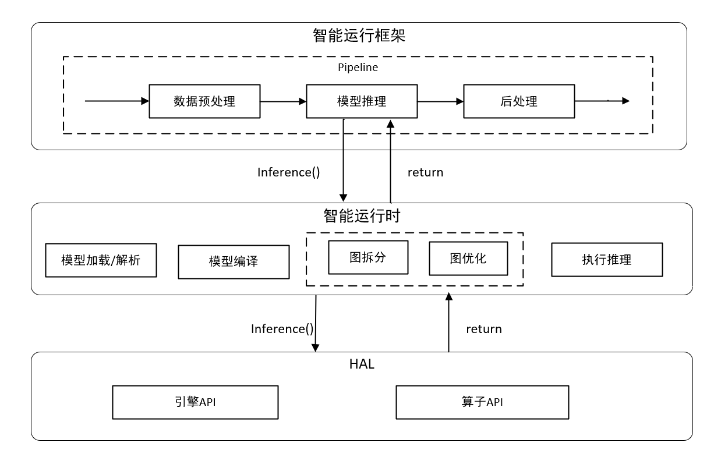

# AIRuntime

## 简介

智能运行模块，向上提供模型加载和模型推理接口，向下调用HAL层接口将模型编译到嵌入式设备，并执行推理。

## 架构

AIRuntime主要分为5部分：
* **airuntime**：模型加载及解析
* **api**：模块对外提供的API接口
* **bridge**：调用AI Chip模块C++接口
* **model**：graph定义
* **smaples**：示例

